# ML_NLP_backtest-trading-strategies

Using Natural Language Processing/MachineLearning,can we train a model to forecast the earnings reports?
Can we have positive returns using the forecasts? 

The data is
1- recent articles about the stock
2- twits about the stock the day of the earning 

We have 6 features: 3 for each data source
-the mean of the sentiment score of the sentences
-the std of the sentences
-the skewness of the sentences

The complete structure of the project, with latests updates looks like this:

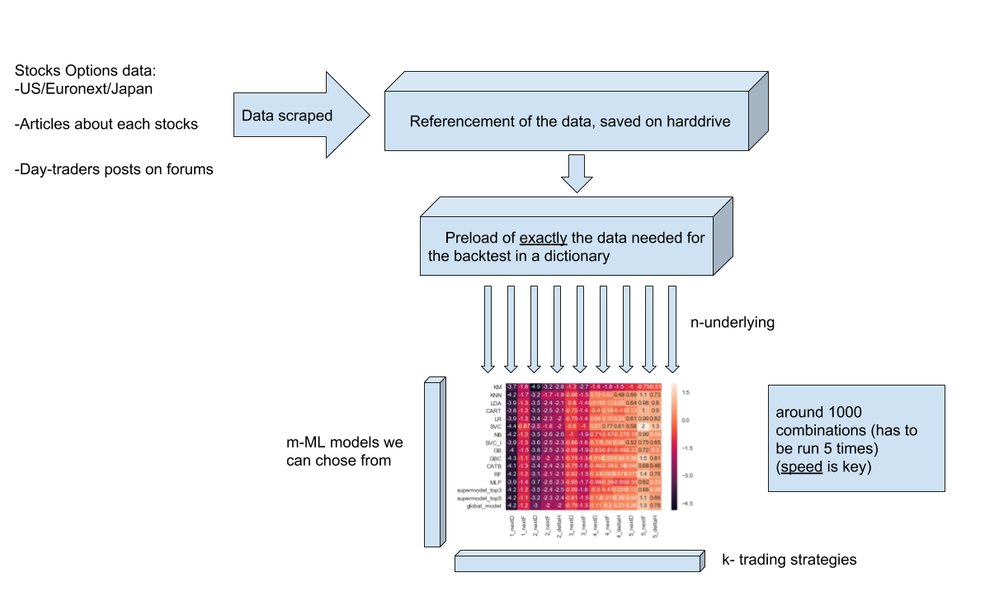

Let's talk about our Machine learning models:

To deal with the non-stationarity of the data and find the accuracy of each model we generate n-iterations with random splits.

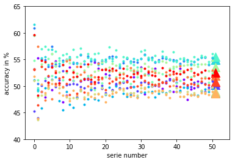

The backtest include multiple strategies, here are some examples: 
#strategy 1: long/short stocks-1 day or -till friday
#strategy 2: long/short the ATM option-1 day or -till friday
#strategy 3: Long/short stocks + covered call/put -1 day or -till friday
#strategy 4: Short straddle, covered leg with stock-1 day or -till friday
#strategy 5: Short the opposite option of the prediction- 1 day or -till friday

We can plot the backtests.

.

We already had the intuition that higher accuracy of the model meant higher returns, and here is the proof:

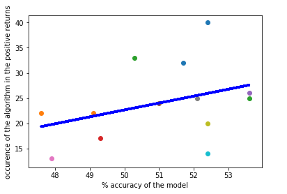

We can also plot the best ones with the strategy type they are from, including their Sharpe Ratios.

If we plot the average return of our results, most of strategies loose money

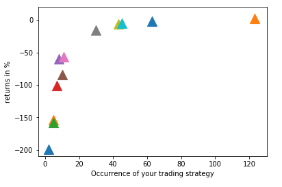

However some rise with positive returns. 

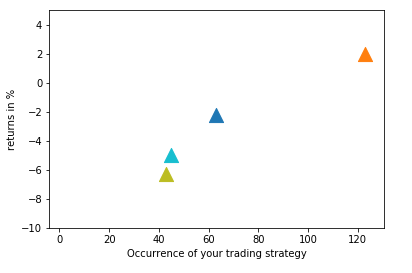

Ultimately, the only positive return strategy has differencies among them. Shown on previous plots, the higher the accuracy, the higher the average return.

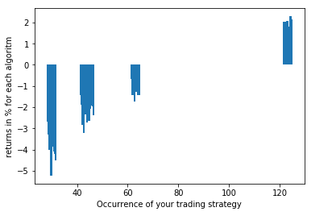

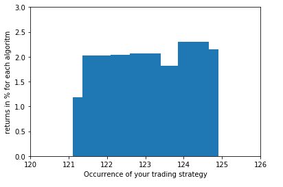

Another cool approach of seeing what's going on is looking at the heatmap of the returns. This completely display how the short theta based strategies tend to outperform

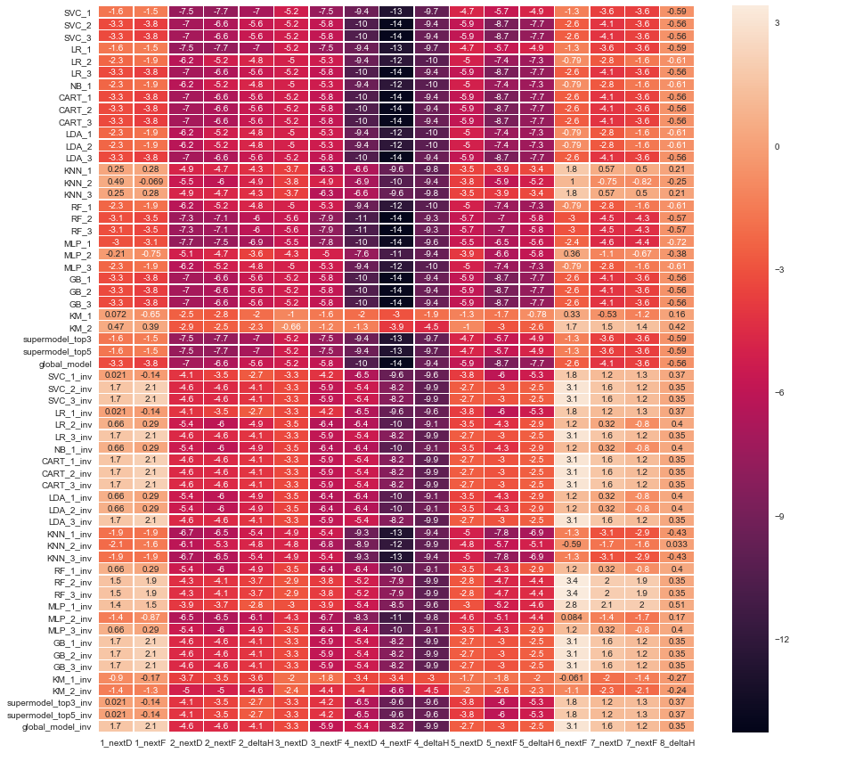

Lately, the possibility to trade 3 trading sessions using brokers API has been added: the following diagram display how it's done

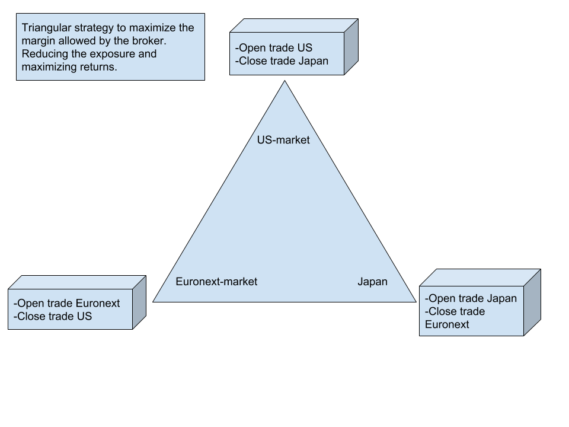

Conclusions: +
-the model we trained "works", however most of our returns burn in fees or into the option spread. 
-The 'real' advantage of our machine learning prediction is almost null (3-4 % better than random at best, this competes with the fees and most of the time don't compensate it)

Side-note:

The best of the best is currently running on paper trading, semi-automated on TD.
The strategies used some techniques to aim for robustness, below the best backtests as well as the technique used to generate our positions.

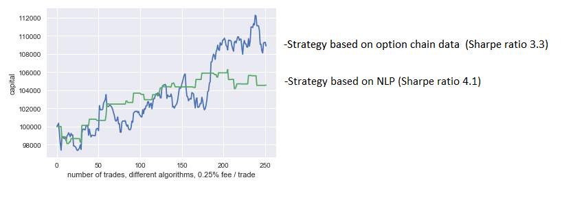
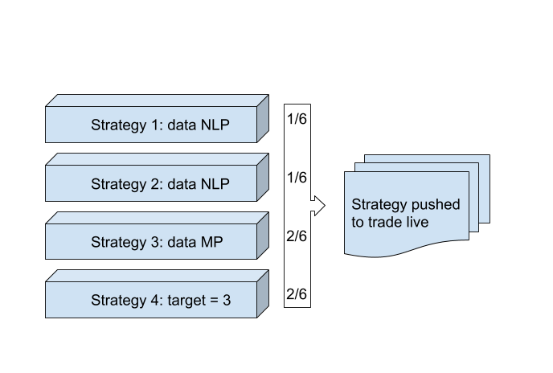

