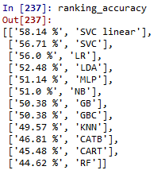
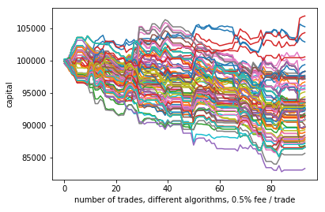
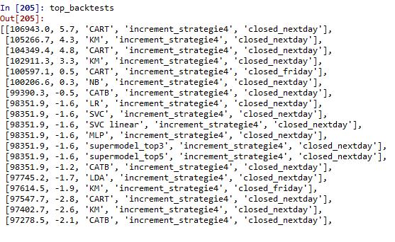

# ML_NLP_backtest-trading-strategies

Using NLP/ML,can we train a model to forecast the earnings reports?

The data is
1- recent articles about the stock
2- twits about the stock the day of the earning 

We have 6 features: 3 for each data source
-the mean of the sentiment score of the sentences
-the std of the sentences
-the skewness of the sentences

The backtest include 4 strategies 
#strategy 1: long/short stocks-1 day or -till friday
#strategy 2: long/short the ATM option-1 day or -till friday
#strategy 3: Long/short stocks + covered call/put -1 day or -till friday
#strategy 4: Short straddle, covered leg with stock-1 day or -till friday

We can plot the backtests.

We can also plot the best ones with the strategy type they are from, including their Sharpe Ratios.
There are 2 features, closing the trade the next day or waiting friday.

Conclusions: +
-the model we trained "work", however most of our returns burn in fees or into the option spread. 
-it is still an ongoing project, new things will be added later, optimizations and tricks to reduce fees. Or managing files with an sql server to take care of the increasingly big number of csv files.

