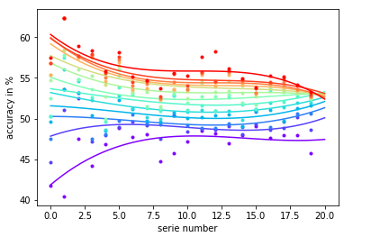
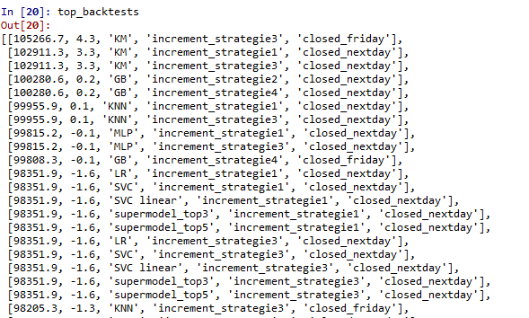
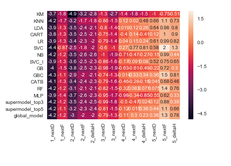
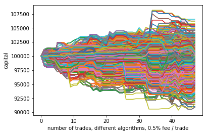
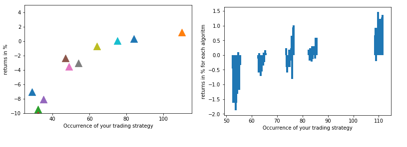

# ML_NLP_backtest-trading-strategies

Using NLP/ML,can we train a model to forecast the earnings reports?
Can we have positive returns using the forecasts? 

The data is
1- recent articles about the stock
2- twits about the stock the day of the earning 

We have 6 features: 3 for each data source
-the mean of the sentiment score of the sentences
-the std of the sentences
-the skewness of the sentences

The more we creates prediction the more the 'true' accuracy of our model reveals.

The backtest include 4 strategies 
#strategy 1: long/short stocks-1 day or -till friday
#strategy 2: long/short the ATM option-1 day or -till friday
#strategy 3: Long/short stocks + covered call/put -1 day or -till friday
#strategy 4: Short straddle, covered leg with stock-1 day or -till friday
#strategy 5: Short the opposite option of the prediction- 1 day or -till friday
#there is also the version for each where we delta hedge the option after 1 day.

We can plot the backtests.

.

We already had the intuition that higher accuracy means higher returns, and here is the proof:

We can also plot the best ones with the strategy type they are from, including their Sharpe Ratios.
There are 2 features, closing the trade the next day or waiting friday.

If we plot the average return of our results, most of strategies loose money

However some rise with positive returns. 

Ultimately, the only positive return strategy has differencies among them. Shown on previous plots, the higher the accuracy, the higher the average return.

Another cool approach of seeing what's going on is looking at the heatmap of the returns. This completely display how the short theta based strategies tend to outperform

Conclusions: +
-the model we trained "works", however most of our returns burn in fees or into the option spread. 
-The 'real' advantage of our machine learning prediction is almost null (3-4 % better than random at best, this competes with the fees and most of the time don't compensate it)

Further:
By adding filter to the signal delivered by the ML models we can optimize the returns. For exemple adding a moving average filter, or others.. Exemple with a 10day MA filter below

